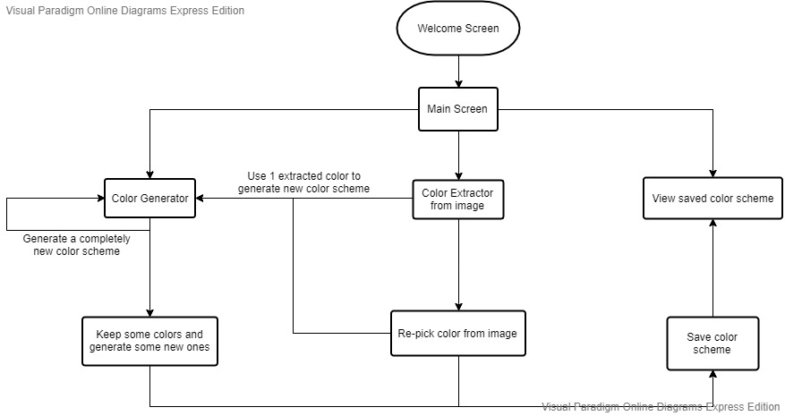
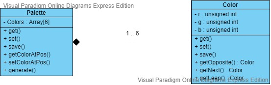

<h1>#Features to be implemented with priority:</h1>
<ol>
    <li>Extract colors from uploaded image (Done)</li>
    <li>Re-pick color from uploaded image (Changed)</li>
    <li>Generate a harmonized color palette from 1 input color (Done)</li>
    <li>Generate a harmonized color palette using 1 picked color from uploaded image (Done)</li>
    <li>Save favorite color palette (Canceled)</li>
    <li>Keep some colors from previous generation and generate a new color palette with those colors (Done)</li>
</ol>

 
 

<h1>#Documents (is subject to change):</h1>
<h3>Features and screens flow chart:</h3>

 
<h3>Class diagram of main classes:</h3>

